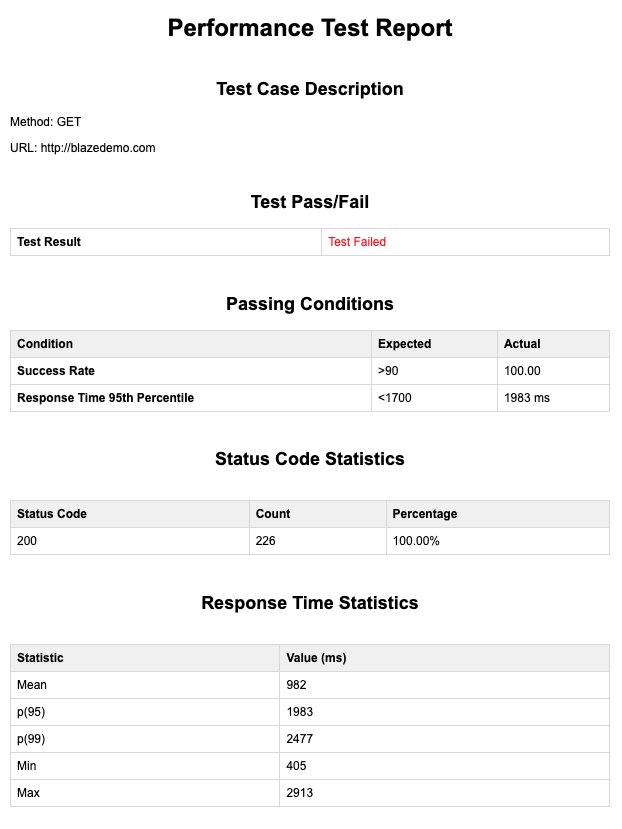
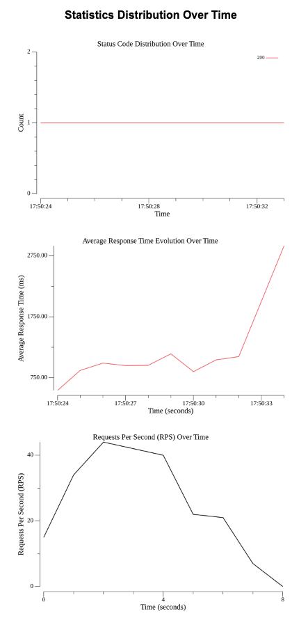

# Jovi

<p align="center"></a></p>

Jovi is a performance testing tool for HTTP endpoints. 

It allows you to specify a configuration file in JSON format containing details about the HTTP request to be made, such as method, URL, phases, etc. 

The tool then executes the requests according to the specified configuration and provides statistics about the performance, to an HTML report inside **report** folder.

## How to Use

1. **Clone this repository to your local machine.**

   ```bash
   git clone git@github.com:joaovsc10/jovi.git
   ```

1. **Navigate to the project directory.**

   ```bash
   cd jovi
   ```

1. **Build the project.**

   ```bash
   go build
   ```

1. **Run the project with the following command, specifying the path to your configuration file:**

   ```bash
   go run main.go --config ./config.json
   ```

Replace ./config.json with the path to your actual configuration file.

## Configuration File

The configuration file is in JSON format and should contain the following fields:

- **method**: HTTP method (Only "GET" works for now).
- **url**: URL of the HTTP endpoint.
- **timeoutSec**: timeout duration in seconds for the HTTP requests made by Jovi.
- **phases**: Array of phases, each containing:
- **duration**: Duration of the phase in seconds.
- **requestsPerSecond**: Number of requests to be made per second during the phase.
- **expectedStatus**: The status code you are expected from the request made.
- **passingConditions**: Conditions for passing the test, containing:
    - **successRate**: Success rate condition, specified as ">X" for greater than X or "<X" for less than X.
    - **responseTime95**: 95th percentile of response time condition, specified as ">X" for greater than X or "<X" for less than X.

Example configuration file:

```json
{
  "method": "GET",
  "url": "https://example.com/api",
  "timeoutSec": 20,
  "expectedStatus": 200,
  "phases": [
    {
      "duration": 30,
      "requestsPerSecond": 10
    },
    {
      "duration": 30,
      "requestsPerSecond": 20
    },
     {
      "duration": 30,
      "requestsPerSecond": 0
    }
  ],
  "passingConditions": {
    "successRate": ">90",
    "responseTime95": "<1700"
  }
}
```

## Reporting

You will be able to generate an HTML report automatically at the end of the execution, that will look like the images below:

<p align="center"></a></p>
<p align="center"></a></p>

## Roadmap

Here are the next steps to improve the tool:
- [ ] Accept other HTTP methods
- [ ] Improve the code that produces the load
  - [ ] Should a specific stage have the req/second rate proporcional to the capacity of the buffered channel?
  - [ ] For a very high rate, the stage takes longer than expected to complece, since it waits for all requests to be made
- [ ] Improve code error handling
- [ ] Add tests
- [ ] Add behaviour to handle timeout requests
- [ ] Add more request metrics (failed rate, VU usage, ...) -> Check k6 default console output
- [ ] Should we allow logic to be executed before the request (setup)?
- [ ] For now, the test is executed within the tool. We should make this a public package.
